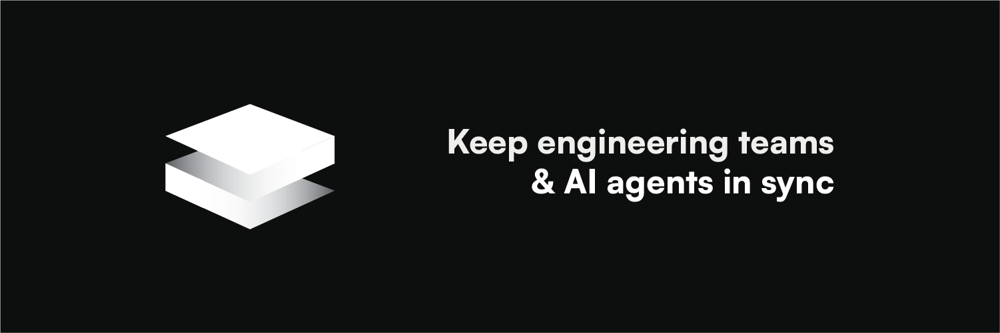
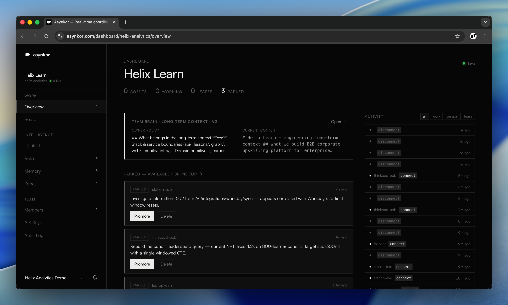

<p align="center">
  <a href="https://asynkor.com">
    
  </a>
</p>

<p align="center">
  <strong>The coordination layer for AI coding agents.</strong><br />
  Git prevents conflicts at merge time. Asynkor prevents them at edit time.
</p>

<p align="center">
  <a href="https://www.npmjs.com/package/@asynkor/mcp"></a>
  <a href="LICENSE"></a>
  <a href="https://github.com/asynkor/asynkor/stargazers"></a>
  <a href="https://asynkor.com/docs"></a>
  
</p>

<p align="center">
  <a href="https://asynkor.com">Website</a> ·
  <a href="https://asynkor.com/docs">Documentation</a> ·
  <a href="#quickstart">Quickstart</a> ·
  <a href="#self-hosting">Self-hosting</a> ·
  <a href="https://github.com/asynkor/asynkor/discussions">Community</a>
</p>

---

<p align="center">
  
</p>

## What is Asynkor

Your team runs Claude Code on one laptop, Cursor on another, Windsurf on a third. The agents don't know about each other. They overwrite each other's edits, duplicate each other's work, and forget yesterday's decisions.

Asynkor gives them one shared brain. Atomic file leases stop two agents from editing the same file. File snapshots flow across machines without `git pull`. Architectural decisions accrue in a memory every agent inherits. Run any MCP-compatible agent — Claude Code, Cursor, Windsurf, JetBrains, Codex.

## See it in action

### Live overview — who's working, on what, where

<p align="center">
  
</p>

Connected agents, what each is doing, which files are leased, recent activity, the long-term project context — one screen, real-time.

Put it on a second monitor. You'll see conflicts forming before they happen and notice when an agent goes silent.

### Board — four ways to view the same work

<p align="center">
  
</p>

One Board page, four lenses. **Table** to scan everything in rows. **Board** for the live state (active / parked / leases). **Timeline** for who ran what when, with pan/zoom. **Graph** for the agent ↔ files constellation with conflict pulses.

Each view answers a different question: *what's happening now*, *when did it happen*, *who's sharing files with whom*.

### Everything else — context, rules, zones, members, audit, settings

<p align="center">
  
</p>

The rest of the dashboard in one pass: **Context** (the long-term project doc), **Rules** (architectural guardrails), **Memory** (compounding team knowledge), **Zones** (protected paths), **Members** (invites and roles), **API Keys**, **Audit Log**, **Settings**. Every agent inherits all of it on the next session.

Five minutes of setup, then every future agent on the team inherits all of it — no onboarding, no re-explaining.

## When to use it

- **Multi-machine teams** — two devs on separate laptops, both with agents editing the same repo. No more "I'll wait until you push."
- **Solo devs across IDEs** — Claude Code at work, Cursor on the personal Mac, Windsurf in JetBrains. One brain across all three.
- **Large agent fleets** — five or more concurrent agents on one codebase. Path-level leasing prevents the chaos that emerges past 3.
- **Cross-repo orchestration** — agents on `frontend/` and `backend/` that need to know about each other's work without manual sync.

## How it works

```
Agent A                          Asynkor                          Agent B
  │                                │                                │
  ├─ asynkor_start(paths=[api.ts]) │                                │
  │  ◄── lease acquired ──────────►│                                │
  │                                │◄── asynkor_start(paths=[api.ts])│
  │                                │──► BLOCKED: api.ts leased      │
  │  ... editing api.ts ...        │                                │
  │                                │     ... works on other files...│
  ├─ asynkor_finish(snapshots)     │                                │
  │  ◄── leases released ────────►│                                │
  │                                │◄── asynkor_lease_wait(api.ts)  │
  │                                │──► acquired + file snapshot    │
  │                                │     writes snapshot to disk    │
  │                                │     edits on top of A's work   │
  │                                │                                │
  │         Both commit. Zero conflicts.                            │
```

When an agent starts work, it **leases** the files it plans to touch. Other agents wait. When the first agent finishes, it uploads a **snapshot** of the files it changed. The next agent receives the snapshot, writes it locally, and edits on top. No `git pull`. No merge conflicts.

## Features

- **File leasing** — atomic Redis Lua scripts, 5-minute TTL, auto-refreshed while alive.
- **Cross-machine file sync** — file content rides through the server in `file_snapshots`. Two laptops, no `git pull`.
- **Parking and handoffs** — pause mid-work, hand off to another agent or developer via `handoff_id`. Plan, progress, and decisions inherit.
- **Overlap detection** — path-level + plan-text similarity. Catches collisions before edits begin.
- **Compounding team memory** — agents `asynkor_remember()` what they learned. Every future session inherits it.
- **Protected zones** — `warn`, `confirm`, or `block` on path globs. Guardrails for `migrations/`, `billing/`, secrets directories.
- **Live dashboard** — `asynkor.com/dashboard` shows active agents, leases, parked work, conflicts, and activity in real time.
- **Any MCP agent** — Claude Code, Cursor, Windsurf, VS Code Copilot, JetBrains, Zed, Codex CLI.

## Quickstart

Two commands. Works with any MCP-compatible agent.

```bash
# 1. Initialize in your project (prompts for API key)
npx @asynkor/mcp init

# 2. Register the MCP server with your agent (Claude Code example)
claude mcp add asynkor -- npx @asynkor/mcp start
```

Restart your editor. From the next session, every agent on the team shares one brain.

<details>
<summary><strong>Other IDEs</strong></summary>

Add to your agent's MCP config:

```json
{
  "mcpServers": {
    "asynkor": {
      "command": "npx",
      "args": ["-y", "@asynkor/mcp", "start"],
      "env": { "ASYNKOR_API_KEY": "your_key_here" }
    }
  }
}
```

Works with Cursor, Windsurf, VS Code (Copilot), JetBrains, Zed, Codex CLI, and any MCP-compatible agent.

</details>

## MCP Tools

**Coordination + history**

| Tool | Purpose |
|------|---------|
| `asynkor_briefing` | Team state: active work, leases, parked sessions, memory, follow-ups, inbox |
| `asynkor_start` | Declare work + acquire file leases |
| `asynkor_check` | Check rules, zones, leases for specific paths |
| `asynkor_remember` / `asynkor_forget` | Save / drop short-term staging memories |
| `asynkor_finish` | Complete work, release leases, upload file snapshots |
| `asynkor_park` | Pause work for another agent to resume |
| `asynkor_lease_acquire` / `asynkor_lease_wait` | Lease additional files mid-work / wait for blocked ones |
| `asynkor_cancel` | Clean up stale or orphaned work |
| `asynkor_context` / `asynkor_context_update` | Read / atomically rewrite the long-term project doc |
| `asynkor_switch_team` | Switch the active team (user-scoped API keys) |

**Agent comms (v0.2 — async messaging between agents)**

| Tool | Purpose |
|------|---------|
| `asynkor_inspect` | Read live state of one teammate's work without interrupting |
| `asynkor_ask` | Open an async thread (work / host / team) |
| `asynkor_inbox` | List threads addressed to me |
| `asynkor_thread` | Read a thread's full transcript |
| `asynkor_reply` | Append a reply (optionally close) |

Full reference at [asynkor.com/docs](https://asynkor.com/docs#asynkor-briefing).

## Built with

- **Go** — MCP server, Lua scripts for atomic Redis ops, NATS pub/sub
- **Redis** — coordination spine: leases, work state, file snapshots
- **TypeScript** — local stdio↔HTTP+SSE proxy that ships as `@asynkor/mcp`
- **MCP** — [Model Context Protocol](https://modelcontextprotocol.io/) so any compliant agent works out of the box

## Architecture

```
Agents (Claude Code, Cursor, Windsurf, Codex)
        │
        │  stdio (MCP protocol)
        ▼
┌─────────────────────────────────┐
│  @asynkor/mcp (TypeScript)      │  ← npm package, runs locally
│  Local MCP proxy                │
└────────────────┬────────────────┘
                 │  HTTP + SSE
                 ▼
        ┌───────────────────┐
        │  asynkor-mcp (Go) │  ← this repo
        │  Coordination     │
        └──┬─────┬─────┬────┘
           │     │     │
        Redis  NATS  HTTP → Backend API
        (leases, (pub/sub)  (auth, teams,
         work,              persistence)
         sync)
```

**Go MCP server** — real-time coordination. File leasing through atomic Lua scripts. Work tracking, overlap detection, team memory distribution, file snapshot sync.

**TypeScript client** — local stdio↔HTTP+SSE proxy. Bridges what IDEs speak (stdio MCP) to what the server speaks (HTTP+SSE). One `npm install` per developer.

**Redis** — the coordination spine. Leases, active work, sessions, file snapshots. All operations through atomic Lua scripts to eliminate race conditions.

## Self-hosting

Run the full stack with Docker Compose:

```bash
git clone https://github.com/asynkor/asynkor.git
cd asynkor
cp .env.example .env  # edit with your values
docker compose up -d
```

Services: Go MCP server, Redis, NATS. The server is stateless — Redis holds all coordination state.

For production deployment with TLS, backups, and monitoring, see the [self-hosting guide](https://asynkor.com/docs#self-host-overview).

## Documentation

Full docs at [asynkor.com/docs](https://asynkor.com/docs):

- [Introduction](https://asynkor.com/docs#introduction)
- [Quickstart](https://asynkor.com/docs#quickstart)
- [MCP Tools Reference](https://asynkor.com/docs#asynkor-briefing)
- [IDE Integrations](https://asynkor.com/docs#claude-code)
- [Team Setup](https://asynkor.com/docs#team-setup)
- [Self-hosting](https://asynkor.com/docs#self-host-overview)

## Community

- [GitHub Issues](https://github.com/asynkor/asynkor/issues) — bug reports and feature requests
- [GitHub Discussions](https://github.com/asynkor/asynkor/discussions) — questions and ideas
- Direct contact: [contact@asynkor.com](mailto:contact@asynkor.com)

## Contributing

See [CONTRIBUTING.md](CONTRIBUTING.md) for development setup and guidelines.

## License

[Apache 2.0](LICENSE)
